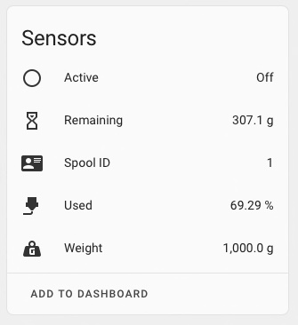

# Hassio Octoprint Filament Manager MQTT Add-On

A Home Assistant Add-On to create sensors for each spool within Octoprint Filament Manager.

![Supports aarch64 Architecture][aarch64-shield] ![Supports amd64 Architecture][amd64-shield] ![Supports armhf Architecture][armhf-shield] ![Supports armv7 Architecture][armv7-shield] ![Supports i386 Architecture][i386-shield]

![Docker pulls][docker-pulls] ![Github version][github-version]

![Lint Workflow][lint-workflow] ![Build Test Workflow][build-test-workflow] ![Release Workflow][release-workflow]

[aarch64-shield]: https://img.shields.io/badge/aarch64-yes-green.svg?style=flat-square
[amd64-shield]: https://img.shields.io/badge/amd64-yes-green.svg?style=flat-square
[armhf-shield]: https://img.shields.io/badge/armhf-yes-green.svg?style=flat-square
[armv7-shield]: https://img.shields.io/badge/armv7-yes-green.svg?style=flat-square
[i386-shield]: https://img.shields.io/badge/i386-yes-green.svg?style=flat-square
[docker-pulls]: https://img.shields.io/docker/pulls/ohheyrj/hassio-addon-octoprint-filament-manager-mqtt-amd64?style=flat-square
[github-version]: https://img.shields.io/github/v/release/systemsmystery/hassio-octoprint-filament-manager-mqtt?style=flat-square
[lint-workflow]: https://img.shields.io/github/workflow/status/systemsmystery/hassio-octoprint-filament-manager-mqtt/Lint?label=lint&style=flat-square
[build-test-workflow]: https://img.shields.io/github/workflow/status/systemsmystery/hassio-octoprint-filament-manager-mqtt/Build%20Test?label=build%20test&style=flat-square
[release-workflow]: https://img.shields.io/github/workflow/status/systemsmystery/hassio-octoprint-filament-manager-mqtt/release?label=release&style=flat-square

## Installation

The easiest way to install the add-on is to add this repo to Supervisor.

1. Go to **Settings** -> **Add-ons** -> **Add-On Store** -> Click ⋮ -> **Repositories**
2. Paste `https://github.com/systemsmystery/hassio-octoprint-filament-manager-mqtt` into the add box and click **Add**
3. Click the **Octoprint Filament Manager MQTT** add-on in the list
4. Click **Install**

## Configuration

| Option Name         | Default                    | Required | Description                                                               | Example                 |
|---------------------|----------------------------|----------|---------------------------------------------------------------------------|-------------------------|
| `octoprint_address` |                            | Yes      | The address of the Octoprint host running filament manager                | `octoprint.example.com` |
| `octoprint_api_key` |                            | Yes      | The API key to use with the specified Octoprint host                      |                         |
| `octoprint_use_ssl` | `false`                    | Yes      | Set to `true` if your Octoprint host uses https                           |                         |
| `mqtt_address`      |                            | Yes      | The address of the MQTT host to send the data to                          | `mqtt.example.com`      |
| `mqtt_port`         | `1883`                     | Yes      | The port on which MQTT is listening                                       |                         |
| `mqtt_topic`        | `octoprintFilamentManager` | Yes      | The MQTT topic that data is sent to                                       |                         |
| `mqtt_username`     |                            | No       | If using authentication with MQTT, the username to use                    |                         |
| `mqtt_password`     |                            | No       | If using authentication with MQTT, the password to use for the above user |                         |
| `update_interval`   | `60`                       | Yes      | The time (in seconds) between each update                                 |                         |
| `loglevel`          | `info`                     | Yes      | Logging level for the add-on                                              |                         |

## Usage

When started, the add-on will create a sensor for each spool within the Octoprint Filament Manager. The sensor will report the following data:

* If the spool is currently set within filament manager (Active)
* The remaining filament for the spool (Remaining)
* The spool ID (Spool ID)
* The used amount of filament (Used)
* The initial weight of the spool (Weight)

Below is an example of what the sensor looks like within Home Assistant:

In addition to each spool sensor, an additional sensor is created which supplies a drop down with each spool ID. This will update and reflect which spool is currently active.

**_Note:_** In a future version of this add-on, the ID selected from the dropdown will also be set as the active spool within filament manager.

## Changelog

A change log with all notable changes to the add-on can be found [here](CHANGELOG.md).

## Issues

If you have any issues with the add-on, please feel free to open an issue on the [Github repository issues page](https://github.com/systemsmystery/hassio-octoprint-filament-manager-mqtt/issues).

Please feel free to also open a pull request if you have a fix or improvement for the add-on.
